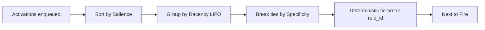

# Agenda Policy

Specifies activation ordering and lifecycle.

## Ordering

- Primary: `salience` descending (higher first).
- Secondary: `recency` LIFO within the same salience bucket.
- Tertiary: `specificity` (more conditions/deeper network first).
- Quaternary: `rule_id` lexical order to guarantee determinism.

## Activations

- Creation: When a token reaches a production node, create an activation with key `{production_id, token_signature}` and metadata `{salience, inserted_at}`.
- De-dup: Keys enforce uniqueness; enqueue updates recency without duplicating entries.
- Cancellation: Any token invalidation removes the activation by key.

## Configuration

- `policy: :default | module()` pluggable implementation.
- `max_queue: integer | :infinity` backpressure threshold.
- `fire_limit: integer | :infinity` per-tick cap to bound latency.

## Determinism

- With fixed inputs and default policy, firing order is reproducible; tests rely on this guarantee.
