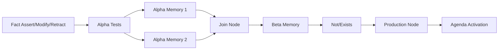

# Architecture — RETE in Elixir (RulesEngine)

This document outlines a practical architecture for implementing a RETE engine in Elixir. It focuses on composable OTP components, clear data models, and efficient incremental matching via shared Alpha/Beta
networks.
The engine is a library runtime exposing pure functions and an OTP runtime. A per-tenant Engine GenServer owns working memory, indexes, and the agenda. Optional PartitionSupervisor can be used for internal parallelism. No Phoenix/gRPC in scope.
Rationale — Why a DSL

- Expressive intent over boilerplate: concise patterns, joins, not/exists, and accumulation.
- Compile-time validation and safety: check schemas/guards; avoid arbitrary code in multi-tenant contexts.
- Optimizable compilation: choose alpha keys/join order; share nodes; enable predicate specialization.
- Determinism and guardrails: consistent agenda/refraction semantics; side-effect-free conditions.
- Operational benefits: text artifacts are diffable, reviewable, and portable over gRPC; better audit and LLM-assisted authoring.

## High-Level Components

```mermaid
flowchart LR
  subgraph LibraryRuntime[Library Runtime]
    Partitions[PartitionSupervisor (optional)]
    subgraph Partitions
      DS1[DynamicSupervisor p0]
      DS2[DynamicSupervisor p1]
      DSn[DynamicSupervisor pN]
    end
  end
  Caller -->|Engine Ops| Partitions
```

- Engine: A `GenServer` coordinating fact ingestion (assert/modify/retract), propagation through the network, agenda management, and RHS action execution.
- Compiler: Transforms rule DSL definitions into a shared RETE network (Alpha/Beta nodes, memories, and indexes) with node sharing and selectivity-driven ordering.
- Network: Immutable graph structure describing nodes and edges; runtime state (memories, indexes) maintained by the Engine.
- Working Memory (WM): Store for active facts (WMEs) keyed by IDs and type, plus lineage links for fast retract/modify.
- Agenda: Conflict set of activations with pluggable policies (salience, recency, specificity) and refraction controls. Specificity default = number of LHS patterns (including not/exists clauses).
- RHS Executor: Executes rule actions (emit derived facts, callbacks) under the Engine’s supervision and boundaries.
- Caller: Your application code using the library APIs (no built-in UI or gRPC).

## Rules and Compilation

- Precompilation: Compile DSL text to IR (see ir.schema.json), then build an immutable network structure with shared nodes and indexes.
- Activation: Engines accept `load_rules/2` to atomically swap to a new network at agenda-safe boundaries.
- Source of rules: Provided by the host application; the library does not prescribe storage or versioning. Shared bundles are possible but out of scope for specs here.

## Multi-Tenancy and Partitioning

- Engine-per-Tenant: Run one Engine GenServer per tenant (keyed by a user-supplied term) to isolate working memory and agendas.
- Optional Internal Partitions: Partition WM and node state by a stable key (e.g., 16–64) under the engine’s control to utilise schedulers. Default partition_key = consistent hash of primary join key(s) declared by rules or of `employee_id` when present.
- Static Network Sharing: The compiled network is immutable and may be shared (e.g., via persistent_term) across tenant engines.
- Co-location Strategy: Choose partition keys to co-locate WMEs that frequently join; cross-partition joins should be rare and bounded.

## Process Registration

- Use Registry or :via tuples for locating tenant engines within your application.
- Cluster routing and discovery are application concerns and out of scope for the library specs.

## Data Model

- WME (Working Memory Element): Map/struct with fields: `id`, `type`, `attrs` (or typed struct fields), `effective_from/to` for temporal filtering.
- Token: Immutable struct representing a partial match: `{bindings, wmes, hash, provenance}` enabling efficient joins and retractions.
- Node IDs: Stable numeric/hashed identifiers produced by the compiler to enable sharing and quick lookups.
- Memories/Indexes:
  - AlphaMemory: Set/index of WMEs passing a specific single-fact test chain; hash indexes by discriminating keys (e.g., `type`, `attrs.key`).
  - BetaMemory: Set/index of tokens on the left side of a join; hash by binding keys to support hash-join on the right input.
  - Storage Backend: Prefer ETS tables per partition and per memory type with `read_concurrency: true`, `write_concurrency: true` for large WM sets (1–2M facts).

## RETE Network Representation



- Alpha Nodes: Single-WME predicate chains compiled from LHS literals (type tests, attribute comparisons, guards). Leaf nodes feed AlphaMemories.
- Beta Layer:
  - Join Nodes: Combine left tokens with right input (AlphaMemory or another BetaMemory) via equality/guard predicates. Prefer hash-join using selected binding keys.
  - Negation/Exists Nodes: Support `not` and `exists` semantics by tracking counter-joins and suppressing/allowing token propagation.
  - Accumulate Nodes: Group-by/aggregate (sum, count, min/max) with incremental maintenance keyed by grouping variables.
- Production Nodes: Terminal nodes for rules; reaching them creates an activation on the agenda.

### Large-Scale Considerations

- Predicate Compilation: Generate specialized predicate functions (via macros/codegen) to reduce per-WME overhead for heavy rulesets (500 rules).
- Key Selection: The compiler estimates selectivity to pick alpha keys and beta hash-join keys that minimize candidate sizes at scale.
- Token Compacting: Tokens store WME IDs and compacted binding vectors rather than large maps; binding lookup is table-based.

## Process Model (OTP)

```mermaid
flowchart TB
  PS[PartitionSupervisor (optional)]
  PS --> DS0[DynamicSupervisor p0]
  PS --> DS1[DynamicSupervisor p1]
  PS --> DSn[DynamicSupervisor pN]
  DS0 -->|start_child hash: tenant_key| Eng0[Engine tenant A]
  DS1 -->|start_child hash: tenant_key| Eng1[Engine tenant B]
```

- One `GenServer` per tenant engine for determinism. All mutations are serialized.
- Partitioned supervision is optional; recommended at higher loads.
- Batching: Accept and process batches atomically to maintain consistent propagation and agenda snapshots.
- Backpressure: Limit in-flight batches; configurable mailbox limits with metrics.
- Parallelism: Internal partitions may process in parallel when enabled; cross-partition effects should be bounded.
- Rule Activation: Load compiled networks via `load_rules/2` at agenda-safe boundaries.

## Fact Lifecycle

1. Assert: Insert WME into WM; route through Alpha nodes to AlphaMemories; propagate to downstream joins; create/extend tokens; enqueue activations.
2. Modify: Compute old vs new deltas; retract contributions from old, then re-assert new variant to maintain correctness.
3. Retract: Remove WME from WM, purge from AlphaMemories/BetaMemories; retract dependent tokens/activations.
At scale, lifecycle operations are routed to the responsible partition by key; modifies that change the key trigger a migrate: retract in old partition, assert in new.

## Agenda and Refraction

- Agenda Policies: Pluggable module implementing ordering; default combines salience, recency (LIFO within salience), and specificity tiebreakers.
- Refraction: Track fired token signatures per production to avoid duplicate firings on identical combinations until inputs change.
- Determinism: With a fixed policy and stable input order, firing order is reproducible for testing.
- Fairness: With 100 concurrent engines, fairness is enforced per-engine; within an engine, the orchestrator rotates partitions to avoid starvation.
- Fire Limits: Cap per-tick fires per partition to bound latency under heavy load.

## Rule DSL and Compilation

- DSL: Elixir macros for declaring rules, patterns, bindings, guards, `not`/`exists`, and `accumulate` (group-by, reducers).
- Compilation Steps:
  - Normalize LHS: Extract type tests, attribute predicates, join keys, and guards.
  - Alpha Plan: Order single-fact tests by selectivity; create/share Alpha nodes and memories.
  - Beta Plan: Build join graph left-to-right using available bindings; choose hash keys; insert negation/exists/accumulate nodes where specified.
  - Production: Attach salience/metadata and generate predicate functions/guards.
- Execution Strategy: Start interpreted (closures for predicates) for simplicity; optionally generate specialized modules for hot paths later.
  - Hot Paths: For 500 heavy rules, enable optional code generation for guards and joins, and precompute constant subexpressions. Cache compiled modules per network version.
- Namespacing: Compile rules with tenant-safe namespaces to avoid module collisions, while enabling sharing of base bundles.
- Validation: Static checks (schema, type predicates, guard purity) and simulation against sample facts prior to compilation.
- Artifact Cache: Keep compiled network and bytecode in a cache keyed by `{tenant, ruleset_id, version}` for fast activation.

## Storage & Snapshots

- In-Memory First: ETS or Elixir maps for WM, AlphaMemories, and BetaMemories; prefer ETS for larger datasets and concurrent reads (future multi-process engines).
- Keys and Indexes: Hash by common discriminators (`type`, `employee_id`, date buckets) to minimize scan costs.
- Snapshots/Recovery: Per-tenant snapshot of WM + agenda for fast restarts (near-zero cold start). Restores compiled network + snapshot on engine start;
  facts can be ingested immediately without rebuilding state.
  - Snapshot content (v0): WMEs by {type,id}, AlphaMemories (by memory_id), BetaMemories (by memory_id), Agenda (activations with token_signature), Refraction sets; versioned by network version.
  - Partitioned Tables: Use named ETS tables per partition and per memory type. Consider compressed term storage where appropriate; measure CPU trade-offs.
  - Memory Budgeting: Track per-partition memory usage; throttle ingest or spill derived-heavy nodes when nearing budget.

## Concurrency and Isolation

- Single writer (Engine) ensures internal consistency of networks/memories.
- RHS Side Effects: Execute via callbacks with isolation; capture failures and allow retries or dead-letter handling. Encourage emitting derived facts over direct I/O in rules.
- Tenant Isolation: Engines do not share WM state; static network is shared only within a tenant engine. Distribute across nodes if memory pressure exceeds budget.

## Tracing and Observability

- Telemetry: Emit :telemetry events for node activations, token creations/retractions, and agenda operations with correlation IDs; operators can forward to Prometheus/OTel/StatsD via handlers.
- Introspection: Query APIs to fetch node stats, memory sizes, and activations; optional visualization hooks for the RETE graph and flows.
- Metrics: Counts for asserts/retracts, propagation time, agenda size, rule fire counts, and cache hit rates.
- High-Scale Defaults: Tracing is disabled by default in production; enable sampling (e.g., 0.1–1%) and per-tenant caps to limit overhead at 100 concurrent engines.

## Time and Calendaring

- All time arithmetic is timezone-aware where relevant (e.g., payroll); standardize on `DateTime` with explicit zones.
- Bucketization utilities for day/week boundaries; split shifts crossing buckets deterministically.

## Performance Considerations

- Selectivity-First Planning: Order alpha/beta tests by expected selectivity to prune early.
- Hash Joins: Maintain per-join hash indexes keyed by bindings; update incrementally.
- Memory Footprint: Deduplicate nodes; compact token structures; use stable IDs and lightweight bindings maps.
- Incremental Aggregates: Accumulate nodes update group totals incrementally instead of recomputing.
- Bulk Load Mode: Specialized path for initial ingestion using larger batch sizes and deferred agenda firing to accelerate first build of 2M facts.
- Partition Affinity: Align join keys and partition function to keep most joins intra-partition, minimizing cross-talk.

## Extensibility

- Pluggable Agenda: Behavior module for custom conflict resolution.
- Custom Nodes: Extend with domain-specific nodes (e.g., windowed aggregates) via a node behavior.
- Storage Adapters: Abstraction for swapping WM/memory backends (in-memory, ETS, Mnesia, or external).
- Distributed Mode (Future): Optional adapter for sharding engines across nodes with a registry and remote partition calls.

## Testing Strategy

- Deterministic Seeds: Fix agenda policy and fact order to produce reproducible traces.
- Property Tests: Network invariants (e.g., retract + assert roundtrips), accumulation correctness, refraction behavior.
- Golden Traces: Record node-level propagation for sample scenarios (payroll/compliance/estimation) and compare.

## Minimal Public APIs (Draft)

- `start_link/1` — start engine with compiled network and options.
- `assert/2`, `modify/2`, `retract/2` — submit deltas; return propagation result or `:ok`.
- `subscribe/2` — stream derived facts or activations.
- `trace/2` — enable tracing for debugging/testing sessions.
