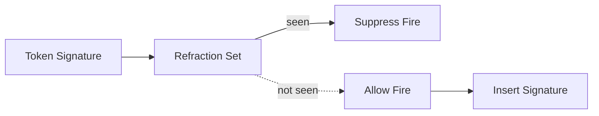

# Refraction Policy

Prevents rules from firing repeatedly on identical token combinations.

## Token Signature

- Components: `{production_id, ordered_wme_ids, binding_hash}`.
- Binding hash: Stable hash of variable bindings used by RHS.
- Ordered WMEs: Deterministically ordered by node plan to avoid permutation duplicates.

## Scope and Lifecycle

- Scope: Per production by default. Optional global refraction for families of rules.
- Insert on fire: Record signature when RHS executes successfully.
- Expire on change: Retract/modify of any contributing WME invalidates signature.
  - Maintain reverse index: `wme_id -> [token_signature]` to invalidate quickly on retract/modify.
- TTL (optional): Time-bounded refraction windows for high-churn scenarios.
- Bounded Storage: Store signatures in partition-local ETS with eviction policy (TTL/LRU). Default: per-production exact set with 24h TTL; cap by bytes per partition. Rule-level override via `refraction_ttl:` metadata; global default via engine opts.

## Overrides

- Rule metadata may set `refraction: :none | :custom` with a custom module to compute signatures.

## Scale Options

- Approximate Sets: Optionally use Bloom filters or HyperLogLog to suppress obvious duplicates with minimal memory when exact refraction is too costly.
