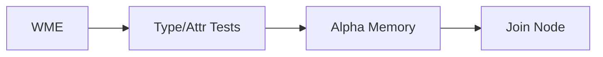

# RulesEngine — A RETE Engine for Elixir

RulesEngine is a greenfield implementation of the RETE algorithm in Elixir. RETE is an efficient, incremental pattern-matching algorithm for production rule systems (expert systems, CEP engines, business rules). This overview introduces RETE, its core parts (Alpha and Beta networks), and outlines concepts that guide the design of this project.

## What Is RETE?

RETE (by Charles Forgy) accelerates rule evaluation when you have many rules operating over a changing set of facts (working memory). Instead of re-scanning all rules against all facts after each change, RETE:

- Caches intermediate matches in a graph of nodes.
- Shares common condition tests across rules.
- Propagates only incremental changes (assert, modify, retract).
This transforms repeated global searches into localized updates, trading extra memory for much faster matching in dynamic environments.

## Core Concepts

- Working Memory Elements (WMEs): Structured facts asserted into the engine (e.g., maps or structs). They have attributes/fields used in conditions.
- Rules (Productions): If-then statements with a left-hand side (LHS) of conditions/patterns and a right-hand side (RHS) of actions to fire when conditions are satisfied.
- Rete Network: A directed graph that matches facts against rule conditions. It consists of the Alpha network (single-fact tests) feeding the Beta network (joins across multiple facts) and ends at production nodes.
- Activations & Agenda: When a rule’s LHS is satisfied, an activation is placed on an agenda. A conflict resolution strategy selects which activation to fire next.
- Refraction: A policy to prevent a rule from firing repeatedly on the exact same combination of facts unless those facts change.

## The Rete Network at a Glance

The network is built from rule conditions and shared across all rules:

- Nodes: Test nodes, memories, join nodes, and production nodes form a DAG-like structure rooted at the top.
- Direction: Facts flow downward as assertions/updates/retractions; matches accumulate as they pass through nodes.
- Sharing: Common tests are compiled only once, so multiple rules reuse the same upstream nodes and memories.

### Alpha Network (Single-Fact Discrimination)

The Alpha network filters individual facts without considering relationships to other facts.

- Purpose: Quickly discard irrelevant facts and route relevant ones to the right parts of the network.
- Alpha Tests: Attribute constraints on a single WME (e.g., `type == :order`, `status == :open`, `amount > 100`).
- Indexing: Efficient discrimination via hashing and comparison chains to minimize downstream work.
- Alpha Memories: Each terminal point of alpha tests stores the subset of WMEs that satisfied those tests.
- Sharing: Identical tests across rules share the same alpha nodes to avoid duplicate work.
- Ordering: More selective tests should appear earlier to prune aggressively (an optimization the compiler can apply).

### Beta Network (Joins and Partial Matches)

The Beta network combines facts that passed alpha tests to satisfy multi-condition rule LHSs.

- Tokens: Partial matches (tuples of WMEs plus variable bindings) that flow through beta nodes.
- Beta Memories: Store sets of tokens produced so far on the left side of a join.
- Join Nodes: Combine left tokens with right WMEs (from an alpha memory or another beta memory) using join conditions (e.g., `?x.id == ?y.customer_id`).
- Semantics:
  - Left Activation: A new/changed token arrives; it is joined against matching candidates from the right input.
  - Right Activation: A new/changed WME arrives; it is joined against existing left tokens.
- Negative/Existential Nodes: Support patterns like “no related fact” (not) and “exists at least one” (exists). These affect how tokens are created/removed when matching counterparts appear/disappear.
- Production Nodes: Leaves of the network; when a token reaches a production node, an activation for the corresponding rule is created.

### Increments: Assert, Modify, Retract

RETE handles changes incrementally:

- Assert: A new fact enters alpha nodes, accumulates through joins, and may create new activations.
- Modify: A fact is updated; the network retracts its old contributions and re-asserts the updated ones.
- Retract: A fact is removed; the network removes any tokens/activations that depended on it.

### Conflict Resolution (Agenda)

When multiple rules are eligible, an agenda strategy picks which to fire next:

- Common Strategies:
  - Recency (LIFO/MEP): Prefer activations derived from the most recent facts.
  - Specificity: Prefer rules with more specific conditions (deeper in the network).
  - Salience/Priority: Rules carry explicit priority values.
- Determinism: Strategy choice affects reproducibility; production systems often allow pluggable policies.

### Refraction

Refraction avoids firing the same rule on the exact same token combination repeatedly. Implementations track token identities (or hashes) that have fired to suppress duplicates until an input change invalidates them.

## Design Considerations for an Elixir Implementation

- Data Model:
  - WMEs: Likely Elixir structs or maps; fields indexed by alpha nodes.
  - Tokens: Immutable structs carrying bindings and ancestry for efficient retract/modify handling.
- Concurrency Model:
  - Engine Process: A `GenServer` (or a small supervision tree) owning the network and agenda.
  - Work Queues: Batches of asserts/modifies/retracts processed atomically to maintain consistency.
  - Side Effects: Rule RHS actions executed under the engine’s control; consider isolation and retries.
- Compilation Pipeline:
  - Rule DSL: Elixir macros to define productions and LHS patterns.
  - Network Build: Compile LHS conditions into a shared Alpha/Beta graph with indexing.
  - Optimization: Test ordering, join selectivity heuristics, node sharing, and memory layout.
- Agenda & Policies:
  - Pluggable strategies (recency, salience, custom) for conflict resolution.
  - Refraction toggles and scoping (per rule, global, time-bounded).
- Determinism & Testing:
  - Ensure predictable firing order under a fixed agenda policy.
  - Provide tracing, visualization hooks, and property tests for network correctness.

## Minimal Terminology Glossary

- WME (Working Memory Element): A fact in the engine.
- Alpha Node: Single-fact test node; outputs to an alpha memory.
- Alpha Memory: Stores WMEs that passed a set of single-fact tests.
- Beta Memory: Stores tokens (partial multi-fact matches).
- Join Node: Combines left tokens with right WMEs/tokens using join conditions.
- Production Node: Declares a rule; receives completed matches and queues activations.
- Activation: A ready-to-fire rule instance on the agenda.
- Agenda: The conflict set plus a selection policy.

## Project Status and Next Steps

This is a fresh start. Planned early milestones:

1. Define a minimal rule DSL (patterns, bindings, guards).
2. Build Alpha network with indexing and memories.
3. Implement Beta joins, tokens, and basic retract/modify.
4. Add production nodes, agenda, and refraction.
5. Provide tracing tools and a small demo.
